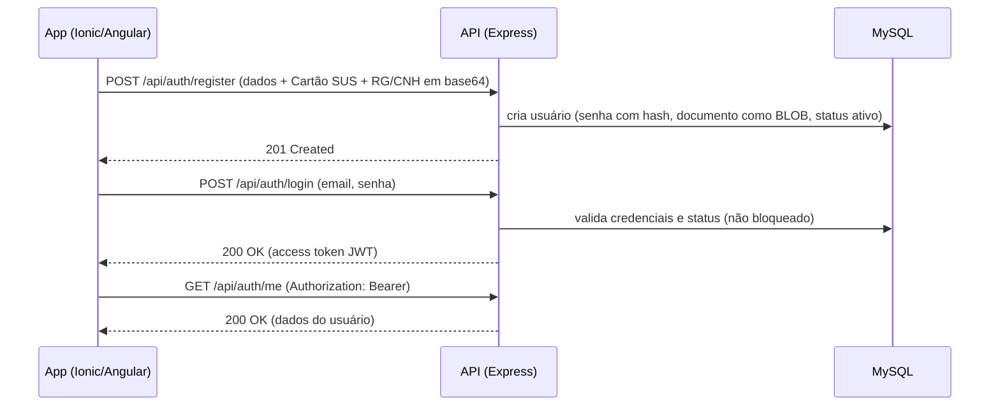
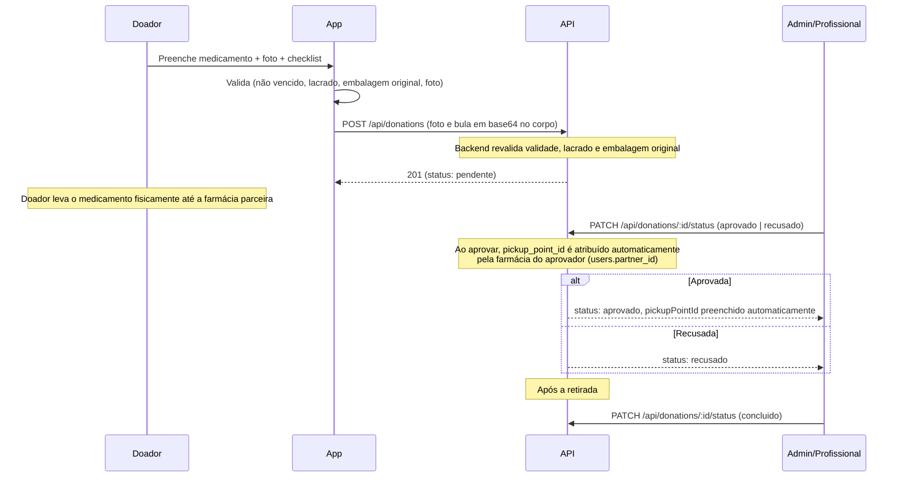
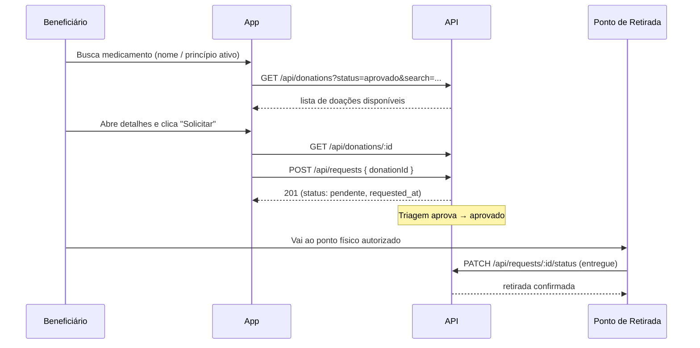
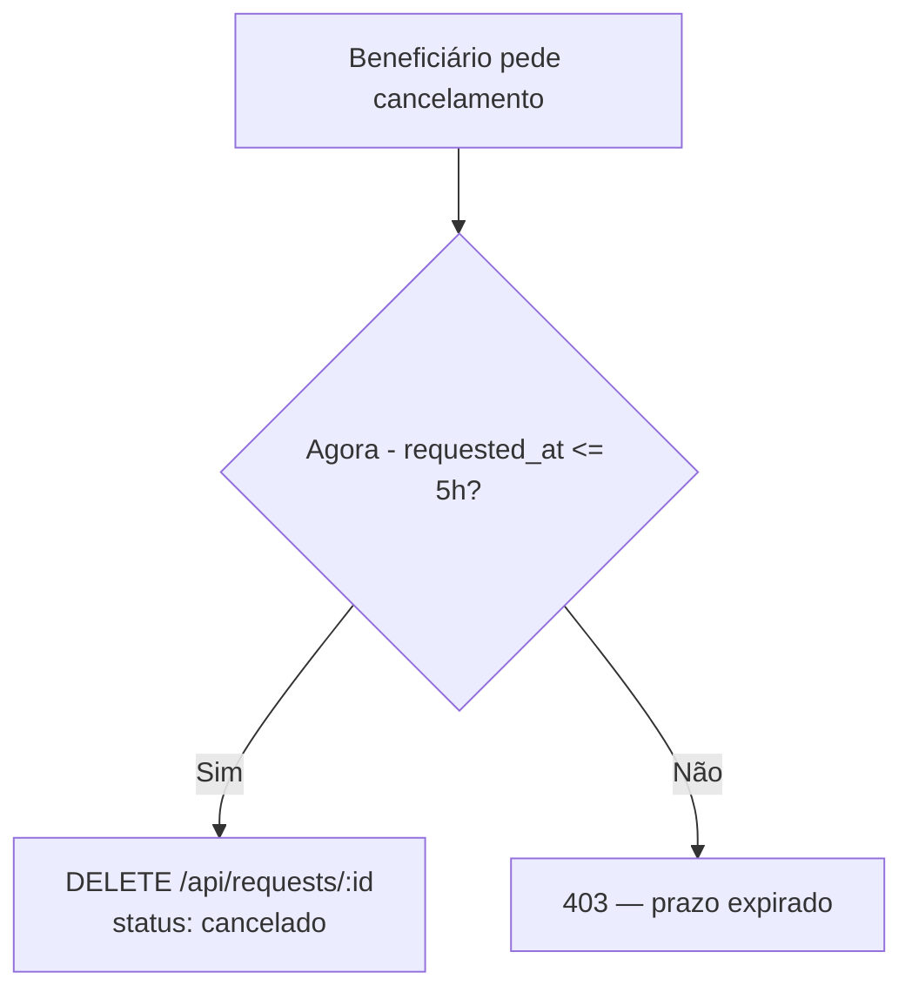

# Fluxos do Sistema — MedLink

> Revisado a partir da análise do protótipo (`mobile-medlink`). Ver [analise-prototipo.md](analise-prototipo.md).

## Autenticação

Autenticação baseada em **JWT** (ver [decisoes-tecnicas.md](decisoes-tecnicas.md), decisão 6).

## Fluxo de Doação

## Fluxo de Solicitação / Retirada

## Regra de Cancelamento (5 horas)

Regra de negócio do protótipo — deve ser validada **no backend**.

## Regras de Segurança Aplicadas

Validações obrigatórias no fluxo de doação (origem: `doar-med.page.ts` e [projeto.md](projeto.md)):

- Validade do medicamento não pode estar vencida
- Medicamento deve estar **lacrado** e em **embalagem original**
- Foto do medicamento é obrigatória
- Triagem por admin/profissional antes de disponibilizar
- Medicamentos controlados exigem receita médica
