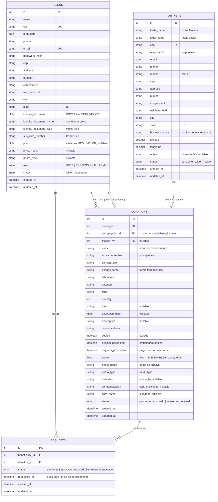
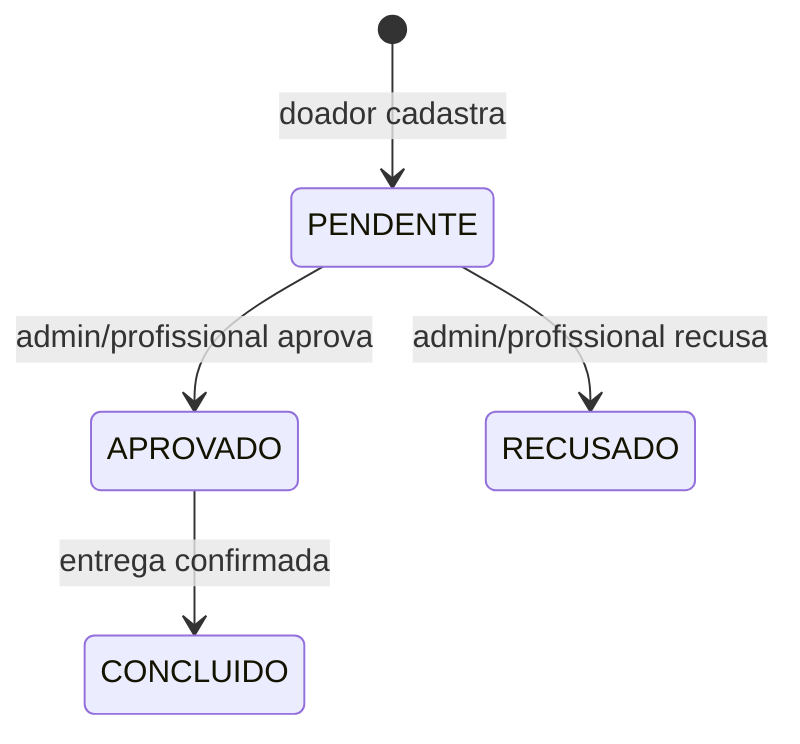
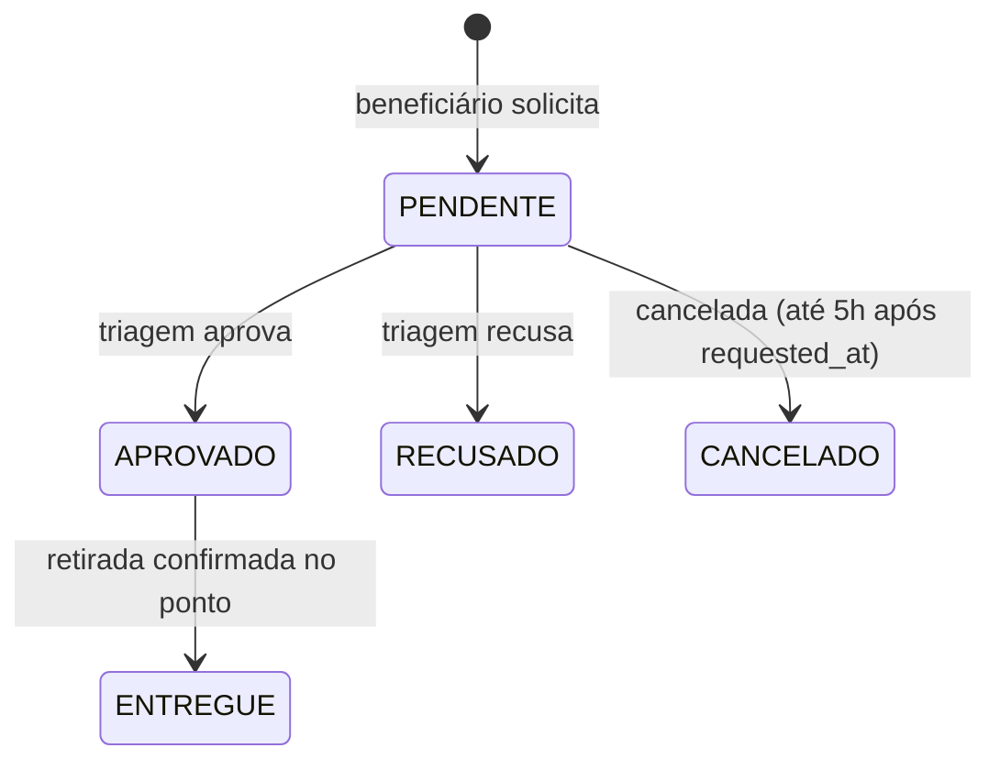

# Modelo de Dados — MedLink

> Revisado a partir da análise do protótipo frontend (`mobile-medlink`, Ionic + Angular).  
> Os campos refletem os formulários e telas reais do app.

## Diagrama de Entidade-Relacionamento

## Entidades

### users
Todos os usuários da plataforma. Campos derivados da tela de **cadastro** e do **perfil**:

- Dados pessoais: nome, CPF, data de nascimento, celular, e-mail, senha
- Endereço completo: CEP, endereço, número, complemento, bairro, cidade, UF
- `identity_document`: binário do RG/CNH (MEDIUMBLOB) — obrigatório no cadastro
- `sus_card_number`: número do Cartão SUS
- `photo`: avatar (MEDIUMBLOB, opcional)
- Cada campo de arquivo tem `_name` e `_type` associados para download correto
- `status`: `ativo` / `bloqueado` — controlado pelo admin
- `role`: `USER` (doa e solicita), `PROFESSIONAL` (triagem) ou `ADMIN`

### donations
**Medicamento doado.** No protótipo, o doador preenche todos os dados do medicamento diretamente no formulário **Doar Medicamento** — não há catálogo pré-existente. Por isso os dados do medicamento ficam embutidos na própria doação (ver [decisoes-tecnicas.md](decisoes-tecnicas.md), decisão 1 — revisada).

- Dados do medicamento: nome, princípio ativo, concentração, forma farmacêutica, laboratório, categoria, tarja
- Quantidade, lote, validade, descrição
- Condições obrigatórias: `sealed` (lacrado) e `original_packaging` (embalagem original)
- `requires_prescription`: quando `true`, o beneficiário deve **apresentar receita médica presencialmente** no momento da retirada — não há upload digital
- Arquivo: `photo` (MEDIUMBLOB, obrigatória). A bula fica fisicamente com o medicamento no ponto de retirada — não é armazenada no banco.
- Informações clínicas (exibidas na tela de detalhes): indicação, contraindicação, cuidados
- `pickup_point_id`: ponto de retirada (definido na triagem)
- `status`: ver máquina de estado abaixo

### requests
**Solicitação** de um medicamento doado por um beneficiário. A tela de detalhes permite "Solicitar", e o perfil mostra a solicitação ativa e o histórico.

- `requested_at`: usado para a **regra de cancelamento de 5 horas** (ver [fluxos.md](fluxos.md))

### partners
**Farmácias/instituições parceiras** que também funcionam como **pontos de retirada**. Unifica o cadastro de parceiro (tela Parceiro) e os locais de retirada exibidos no app.

- Dados cadastrais: nome fantasia, razão social, CNPJ, responsável, contatos
- Endereço + geolocalização (`latitude`/`longitude`) para exibição no mapa
- `business_hours`: horário de funcionamento
- `status`: `pendente` (aguardando aprovação após cadastro), `ativo`, `inativo`

## Valores de Status (PT-BR)

O frontend já usa rótulos em português. Para manter compatibilidade, a API deve expor os mesmos valores em português, sem necessidade de um segundo mapeamento no app.

| Entidade | Valor canônico (API) | Rótulo exibido no app |
|---|---|---|
| donations | pendente | Pendente |
| donations | aprovado | Aprovado |
| donations | recusado | Recusado |
| donations | concluido | Concluído |
| requests | pendente | Pendente |
| requests | aprovado | Aprovado |
| requests | recusado | Recusado |
| requests | entregue | Entregue |
| requests | cancelado | Cancelado |
| users | ativo | Ativo |
| users | bloqueado | Bloqueado |
| partners | pendente | Pendente |
| partners | ativo | Ativo |
| partners | inativo | Inativo |

## Máquinas de Estado

### donations.status

### requests.status

## Armazenamento de Arquivos

Arquivos são armazenados **diretamente no MySQL como BLOB** (ver [decisoes-tecnicas.md](decisoes-tecnicas.md), decisão 10).

| Campo | Tabela | Tipo MySQL | Obrigatório |
|---|---|---|---|
| `photo` | `donations` | MEDIUMBLOB | Sim |
| `identity_document` | `users` | MEDIUMBLOB | Sim |
| `photo` | `users` | MEDIUMBLOB | Não |

Cada campo binário tem dois campos auxiliares: `_name` (nome do arquivo original) e `_type` (MIME type, ex: `image/jpeg`, `application/pdf`), necessários para o download correto no frontend.

O frontend já envia arquivos como base64 (ver `perfil.page.ts` → `documentoBase64`). A API recebe base64, converte para Buffer e persiste no banco.

**Receita médica:** não é armazenada digitalmente. Para medicamentos com `requires_prescription = true`, a receita é verificada **presencialmente** no ponto de retirada (ver decisão 12).
